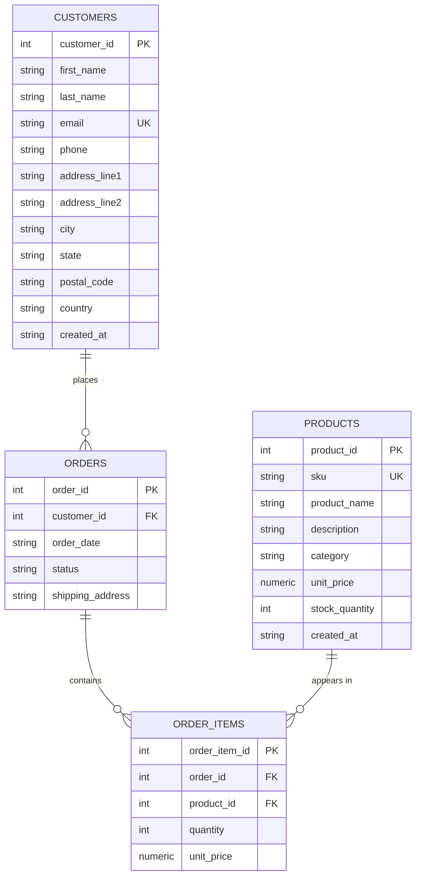

# Entity-Relationship Diagram — E-Commerce Schema

Corresponds to the tables defined in [`schema.sql`](./schema.sql).

## Normalization decisions

The schema is in **third normal form (3NF)**. Every table has a single-column
surrogate primary key (an `INTEGER PRIMARY KEY AUTOINCREMENT`), so partial
dependency (a non-key column depending on only *part* of a composite key)
cannot occur, and every non-key column depends only on that table's own
primary key rather than on another non-key column, ruling out transitive
dependency. Concretely: a customer's `city`/`state`/`postal_code` describe
that customer only and live in `customers`, not repeated on every `order`;
a product's `category` and `unit_price` describe that product only and live
in `products`, not repeated on every `order_item`. The classic many-to-many
relationship between orders and products — one order can contain many
products, and one product can appear on many orders — is resolved with the
`order_items` junction (associative) table, which carries the relationship's
own attributes (`quantity` and the line's `unit_price`) rather than forcing
either side to repeat data or store multi-valued fields. The one column that
looks redundant at first glance, `order_items.unit_price`, is deliberately
*not* a normalization violation: it does not duplicate `products.unit_price`,
it records a different fact — the price the customer was actually charged at
the moment the order was placed. Without this column, a later price change in
`products` would silently rewrite the amount on every historical invoice that
referenced that product, which is a correctness bug, not a normalization
improvement.
