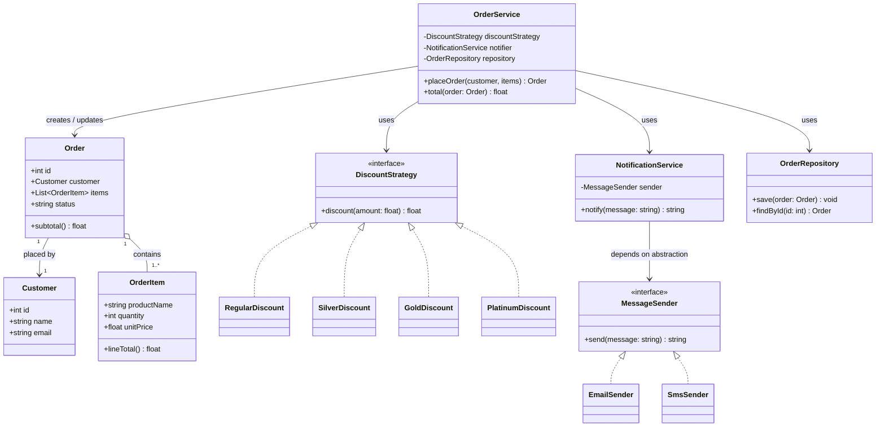

# Software Design & Architecture - Lab Notes

This folder contains reference material on two related topics:

- **SOLID principles** at the class-design level
  (`../patterns/solid_principles.py`)
- **Architecture patterns** at the system-design level
  (`../patterns/architecture_patterns.md`)

This README ties the two together with a class diagram for a small
example domain (an order-processing system) and notes on modularity and
separation of concerns.

## Contents

```
Software-Design/
├── patterns/
│   ├── solid_principles.py       # 5 runnable before/after SOLID demos
│   └── architecture_patterns.md  # Layered / MVC / Microservices notes
└── documentation/
    └── README.md                 # this file
```

## How to run the code

The example code is plain Python 3 standard library, no external
dependencies required.

```bash
# from the Software-Design/ directory:
python patterns/solid_principles.py

# optional: verify it's syntactically valid without running it
python -m py_compile patterns/solid_principles.py
```

Running the script prints five sections (SRP, OCP, LSP, ISP, DIP), each
showing the "BEFORE" (violation) output followed by the "AFTER" (fixed)
output, so the behavioral difference between the violation and the fix
is visible directly in the console.

There is no external test framework wired up; the script is
self-verifying in the sense that every demo function executes all of
its code paths and prints its results - if any class were broken, the
script would raise an exception instead of completing all five
sections and printing the final "All SOLID before/after demos ran
successfully." banner.

---

## Example domain: order processing

To make the SOLID and architecture ideas concrete, here is a class
diagram for a small order-processing system. It intentionally reuses
the same *shapes* of abstraction that appear in `solid_principles.py`
(a pluggable discount strategy, a pluggable notification channel, a
separate persistence class) so the mapping between the diagram and the
code is direct.



### Reading the diagram

- `Order` is a plain data holder: it knows about its own `OrderItem`s
  and its `Customer`, and can compute its own subtotal, but it has no
  idea how discounts are calculated, how it gets saved, or how a
  customer gets notified about it.
- `OrderService` is the orchestration/use-case layer: it depends on
  three separate abstractions (`DiscountStrategy`, `NotificationService`,
  `OrderRepository`) rather than containing pricing rules, persistence
  code, and notification code itself.
- `DiscountStrategy` and `MessageSender` are both interfaces
  (`<<interface>>`) with multiple interchangeable implementations - this
  is exactly the OCP and DIP shape demonstrated in
  `solid_principles.py`.

---

## Modularity and separation of concerns

**Modularity** means the system is decomposed into units (modules,
classes, services) with well-defined boundaries and responsibilities,
so that a change inside one unit is unlikely to require changes in
unrelated units. **Separation of concerns** is the design goal that
drives modularity: each unit should own exactly one concern (e.g.
"calculating a discount," "sending a notification," "persisting an
order") rather than mixing several unrelated concerns together.

In the order-processing diagram above:

- Pricing rules (`DiscountStrategy` implementations), notification
  channels (`MessageSender` implementations), and persistence
  (`OrderRepository`) are each isolated behind their own abstraction.
- `OrderService` depends only on those abstractions, not on their
  concrete implementations - so swapping `EmailSender` for `SmsSender`,
  or adding a `PlatinumDiscount`, never requires touching
  `OrderService`, `Order`, or any unrelated part of the system.
- This mirrors the layered architecture idea from
  `../patterns/architecture_patterns.md`: `OrderService` sits in a
  "business logic" role, coordinating lower-level, single-purpose
  collaborators, the same way a Business Logic layer coordinates a
  Data Access layer without embedding SQL directly inside it.

## How this shows up in `solid_principles.py`

Each SOLID demo in the code file corresponds to a design decision that
also appears in the order-processing diagram above:

- **SRP** - `Invoice` / `InvoiceFormatter` / `InvoiceRepository` split
  formatting and persistence into separate classes, the same way the
  diagram keeps `Order` (data), notification, and persistence
  (`OrderRepository`) as separate collaborators instead of one class
  that does everything.
- **OCP** - `DiscountStrategy` and its subclasses
  (`RegularDiscount`, `SilverDiscount`, `GoldDiscount`,
  `PlatinumDiscount`) are reused directly as the discount abstraction
  in the diagram: adding a new discount tier means adding a new class,
  never editing `OrderService`/`DiscountCalculator`.
- **LSP** - `Shape` / `Rectangle` / `Square` show why substitutable
  types must honor a common, honest contract. The same discipline
  applies to `DiscountStrategy` and `MessageSender` implementations in
  the diagram: any concrete strategy or sender must be swappable
  without `OrderService` needing to know (or care) which one it got.
- **ISP** - `Workable` / `Eatable` show splitting a fat interface into
  focused ones. If `OrderService` needed a fat `OrderProcessor`
  interface that bundled pricing, notification, *and* persistence
  methods together, every implementation would be forced to provide
  all three even when it only needed one - which is exactly why the
  diagram keeps `DiscountStrategy`, `MessageSender`, and
  `OrderRepository` as three separate, narrow abstractions instead.
- **DIP** - `NotificationService` depending on the `MessageSender`
  abstraction (rather than a concrete `EmailSender`) is reused
  unchanged in the diagram: `OrderService` depends on
  `NotificationService`, which in turn depends only on the
  `MessageSender` abstraction, so the concrete channel can be injected
  and swapped freely.

Together, the SOLID examples show the *class-level* discipline, and the
architecture notes show the *system-level* discipline; the
order-processing diagram is the point where both meet in one coherent
example.
