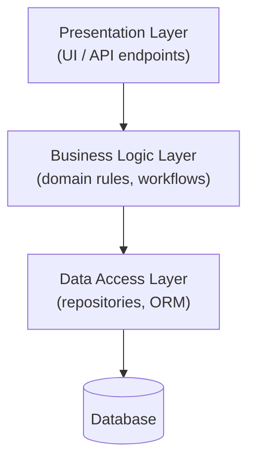
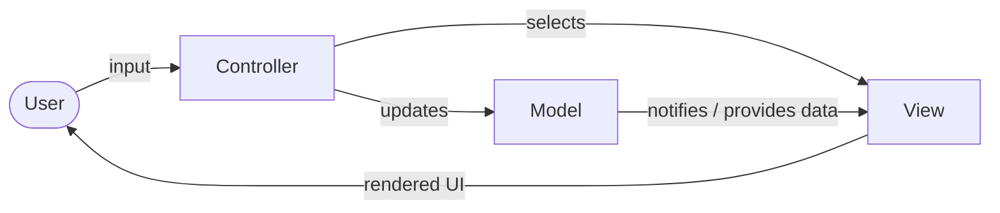
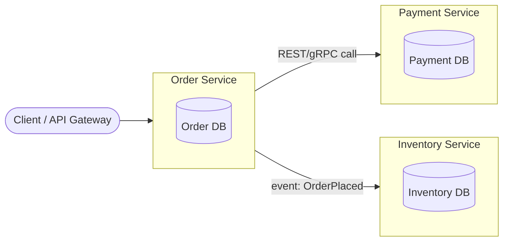

# Architecture Patterns: Layered, MVC, and Microservices

Notes comparing three common software architecture patterns, with a
diagram for each and a short discussion of the coupling/cohesion
trade-offs they make. These patterns operate at different granularities
(a single-process style, a UI-organizing style, and a distributed-systems
style) but are commonly compared because most real systems combine two
or three of them at once (e.g. a microservice whose *internals* are
organized in layers, one of which is an MVC-style web layer).

---

## 1. Layered / N-Tier Architecture

A layered architecture splits a system into horizontal layers, where each
layer only depends on the layer(s) directly beneath it. A classic 3-tier
split is Presentation -> Business Logic -> Data Access, often with the
database itself counted as a fourth "tier."

```
+-------------------------------------------------+
|              Presentation Layer                  |
|   (UI, HTTP controllers, CLI, API endpoints)      |
+-------------------------------------------------+
                       |  calls down
                       v
+-------------------------------------------------+
|             Business Logic Layer                  |
|   (domain rules, validation, workflows)            |
+-------------------------------------------------+
                       |  calls down
                       v
+-------------------------------------------------+
|              Data Access Layer                     |
|   (repositories, ORM, SQL queries)                 |
+-------------------------------------------------+
                       |  reads/writes
                       v
+-------------------------------------------------+
|                   Database                         |
+-------------------------------------------------+
```

Mermaid equivalent:



### Coupling / cohesion trade-offs

- **Coupling**: Each layer is coupled only to the layer immediately below
  it (assuming the "strict layering" variant is followed). This keeps
  coupling *directional* and predictable: the Presentation layer knows
  about Business Logic, but Business Logic knows nothing about
  Presentation. This is a good default for medium-sized applications
  because it keeps changes localized - swapping a REST API for a CLI
  should only require rewriting the Presentation layer.
- **Cohesion**: Cohesion within a layer can be weak if the layer is
  defined purely by *technical* role (e.g. "everything that talks to
  the database") rather than by *domain* concept. A single "Data Access
  Layer" folder can end up containing repositories for completely
  unrelated entities (orders, users, invoices) that have nothing to do
  with each other except that they all perform I/O. This is sometimes
  called the "layered monolith" smell.
- **Common pitfall**: layers "leaking" - e.g. the Presentation layer
  directly importing an ORM model from the Data Access layer to avoid
  writing a mapping/DTO step. This silently reintroduces tight coupling
  between layers that were supposed to be independent, and is one of
  the most frequent real-world violations of this pattern.
- **When it fits well**: internal tools, CRUD-heavy business
  applications, and systems where the team is small enough that a
  single deployable unit is easier to operate than a distributed system.

---

## 2. MVC (Model-View-Controller)

MVC splits an application (typically the Presentation layer of the
system above, or a whole small application) into three collaborating
parts:

- **Model** - domain data and business rules; has no knowledge of the UI.
- **View** - renders the model's data to the user; ideally has minimal logic.
- **Controller** - receives input/requests, updates the Model, and
  chooses which View to render.

```
        user input
             |
             v
      +-------------+
      | Controller  |
      +-------------+
        |         |
  updates|         |selects
        v         v
   +---------+  +--------+
   |  Model  |->|  View  |
   +---------+  +--------+
        |            |
        +----render---+
             |
             v
        rendered UI
```

Mermaid equivalent:



### Coupling / cohesion trade-offs

- **Coupling**: The Controller is coupled to both the Model and the
  View (it has to know which model methods to call and which view to
  render), which is intentional - the Controller's whole job is to be
  the coordination point. The valuable coupling *reduction* is between
  Model and View: the Model should have zero knowledge of how (or
  whether) it is being displayed, which lets the same Model be reused
  behind a web View, a mobile View, or an API serializer.
- **Cohesion**: Each part has a single, clear concern (data/rules vs.
  rendering vs. coordination), which is good for cohesion in principle.
  In practice, "fat controllers" are the most common failure mode -
  business logic creeps into the Controller because it's the
  convenient place to put "just one more if-check," which lowers the
  Controller's cohesion and re-introduces business rules outside the
  Model where they can't easily be reused or unit-tested in isolation.
- **Variants**: MVP (Model-View-Presenter) and MVVM
  (Model-View-ViewModel) are close relatives that shift exactly where
  the "reacts to input and updates the view" responsibility lives, but
  they all preserve the same core goal: keep the Model ignorant of
  the View.
- **When it fits well**: interactive UI-heavy applications (web
  frameworks, desktop apps, mobile apps) where the same underlying data
  may need multiple visual representations.

---

## 3. Microservices Architecture

Microservices decompose a system into a set of small, independently
deployable services, each owning its own data store and communicating
over the network (HTTP/REST, gRPC, message queues, etc.), rather than
via in-process function calls.

```
   +------------+       +------------+       +------------+
   |   Order    |       |  Payment   |       | Inventory  |
   |  Service   |------>|  Service   |       |  Service   |
   +------------+       +------------+       +------------+
        |   \                                      ^
        |    \-------------- events / API ---------|
        v
   +------------+       +------------+       +------------+
   |  Order DB  |       | Payment DB |       | Inventory  |
   +------------+       +------------+       |     DB     |
                                              +------------+

        All cross-service calls happen over the network
        (HTTP, gRPC, or an async message broker).
```

Mermaid equivalent:



### Coupling / cohesion trade-offs

- **Coupling**: Runtime coupling between services is intentionally
  loosened - services can be deployed, scaled, and even rewritten
  independently, as long as their network contract (API schema, event
  schema) stays compatible. The trade-off is that coupling doesn't
  disappear, it *moves* - now it lives in the network contracts, in
  shared understanding of eventual consistency, and in operational
  concerns like versioning and distributed tracing. A breaking API
  change is arguably harder to coordinate across independently
  deployed services than an equivalent change inside a single codebase.
- **Cohesion**: Done well, each service has very high cohesion - it
  owns one bounded business capability (e.g. "orders") end-to-end,
  including its own data. This is the main payoff: teams can reason
  about, test, and deploy one service without needing to understand
  the whole system.
- **New costs this pattern introduces**: network latency and partial
  failure (a call that used to be a function call can now time out or
  fail independently), data consistency across service boundaries
  (no more cross-service database transactions/JOINs), and operational
  overhead (service discovery, monitoring, distributed logging,
  versioned contracts).
- **When it fits well**: large systems with multiple independent teams
  where the ability to deploy and scale parts of the system separately
  outweighs the added operational complexity. It is frequently *not*
  the right starting point for a small system or a small team - the
  coordination and infrastructure cost can dominate before the
  independent-scaling benefits pay off.

---

## Summary Comparison

| Pattern        | Granularity                | Primary coupling reduction                  | Primary cohesion goal                         | Typical cost introduced                        |
|----------------|-----------------------------|----------------------------------------------|--------------------------------------------------|-------------------------------------------------|
| Layered/N-Tier | Within one process/deployable | Layers depend only downward, not upward      | Group code by technical responsibility           | Risk of shallow, technically-grouped layers    |
| MVC            | Within the presentation layer | Model has no knowledge of View               | Separate data/rules, rendering, and coordination | Controllers can accumulate stray business logic |
| Microservices  | Across independent deployables | Services depend only on published network contracts | Each service owns one bounded business capability | Network failure modes, distributed data consistency, operational overhead |

A useful way to hold these together: a single microservice's *internals*
are very often organized as layers, and if that microservice serves a
web UI, its presentation layer is very often organized using MVC. The
three patterns are not mutually exclusive alternatives so much as
decisions made at different zoom levels of the same system.
